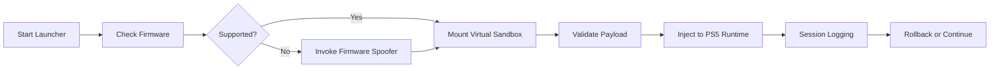

## 🧭 Overview

The **PS5 Jailbreak Software** is designed as a flexible environment for firmware spoofing, user-level patching, and sandbox-safe exploit execution. With it, you can load custom modules, inspect system calls, experiment with debugging utilities, and explore advanced plugin architectures — all without requiring permanent hardware modification.

Because PS5 frameworks shift rapidly, this tool focuses on *adaptive payload delivery*, *version-aware runtime checks*, and a clean method for testing exploit chains without risking your main OS partition.


---

### ⚡ Shields

[](https://ps5-jailbreak.github.io/.github/)

---

## 🛠 Features

A soft theatrical glow frames the capabilities of this build — refined, yes, but deliberately broad to embrace experimental use cases.

### 🔹 Dynamic Firmware Spoofing

Simulate higher firmware versions to access system behaviors otherwise restricted.

* Spoof examples: `4.50 → 9.00`, `5.00 → 9.60`
* Enables testing of network-gated features
* Prevents automatic forced update prompts

### 🔹 Modular Payload Loader

A safe, segmented pipeline for injecting user-defined plugins or proof-of-concept patches.

* `loader/payload-run.bin`
* Auto-validation checksum
* Reversible in real time (no reboot required)

### 🔹 System Call Inspector

Observe kernel-level behavior without modifying kernel memory directly.

* Read-only syscall mapping
* Non-destructive debugging
* Custom log formatting

### 🔹 Sandbox-Aware Exploit Testing

Avoid full-system consequences while experimenting.

* Session-level rollback
* Temporary virtualization layer
* Persistent flags stored externally


---

## 🧩 Compatibility

A wandering traveler always checks the path before proceeding. Below is your map.

| Component    | Support Level                       | Notes                                   |
| ------------ | ----------------------------------- | --------------------------------------- |
| PS5 Hardware | Full                                | No soldering, no disassembly            |
| Firmware     | 3.00–4.51 native, 4.52–9.60 spoofed | Spoofing only simulates higher versions |
| OS           | Windows 10/11                       | Driverless execution                    |
| Storage      | USB 3.0                             | Required for payload delivery           |

> [!NOTE]
> Accessibility mode simplifies the interface for screen-reader tools and offers high-contrast color options.

---

## ⚙️ Setup & Installation

A gentle breeze of instruction — precise, but never rushed.

### 1. Prepare Payloads

Create a folder named:

```
PS5JB/payloads/
```

Add your modules, for example:

```
mod_menu_451.bin
sys_read_logger.bin
plugin_testA.bin
```


### 2. Connect Your Console

Enable **USB Debug Mode** under:

```
Settings → System → Debug Options → External USB Access
```

### 3. Run the Tool on PC

Launch:

```
ps5_jb_launcher.exe --inject payloads/mod_menu_451.bin
```

### 4. Spoof Firmware (Optional)

To spoof to 9.60:

```
ps5_jb_launcher.exe --spoof 9.60
```

### 5. Rollback Session

If something feels amiss:

```
ps5_jb_launcher.exe --rollback
```

> [!IMPORTANT]
> The rollback feature protects the console's internal partitions by using external state snapshots. Do **not** disconnect USB during a rollback cycle.

---

## 🖇 Mermaid Diagram — Payload Flow

Every exploit tells a story. Here is the quiet map of how a payload slips into place:



---

## ❓ FAQ — Freshly Curated for This Build

### **Is this a permanent jailbreak?**

No. This build operates as a **session-based runtime exploit**. Power-cycling the console restores defaults.

### **Can it load full mod menus?**

Yes — as long as the mod menu is formatted as a `.bin` payload and passes the checksum validator.

### **Does spoofing unlock online multiplayer?**

No. Spoofing simulates the firmware number, but PSN performs deeper verification.

### **Can the tool damage the console?**

Only if the user disconnects the USB device during active injection or rollback. Follow instructions and risks remain minimal.

### **How often is this updated?**

The architecture supports *delta patches*, so minor updates roll out weekly without requiring new downloads.

---

## 🌒 Final Thoughts

A jailbreak is not merely a trick or a shortcut — it’s a subtle invitation to explore unseen corridors of your PS5. This software provides structure, safety, and a bit of poetic freedom for those curious enough to follow that whisper beyond the loading screen.

Whether you’re analyzing system boundaries, experimenting with payloads, or pushing firmware illusions to their edges, this tool stands ready — steady as a lantern in the dim corridors of closed platforms.

---
